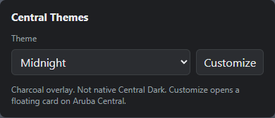
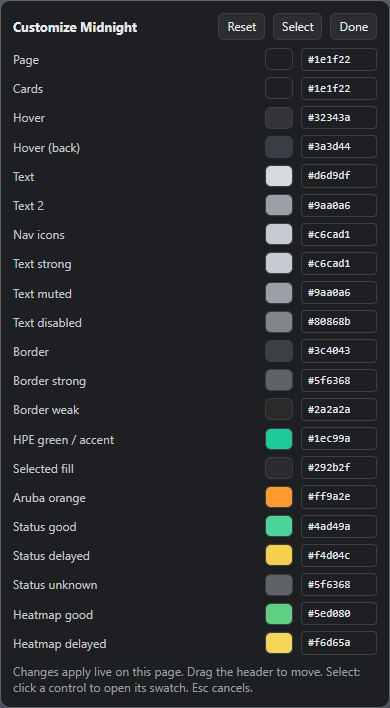
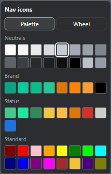
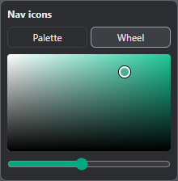

# Central Themes

Unofficial browser extension that themes [Aruba Central](https://www.arubanetworks.com/products/network-management-operations/central/).

This project is not affiliated with HPE or Aruba.



## What it does (v0.2.6)

- Five themes from a popup menu: **Central Light**, **Dim**, **Midnight**, **High Contrast**, and native **Central Dark**
- Overlay themes sit on Central’s light UI and remap Gravity CSS variables
- **Customize** opens a floating card on Central so you can edit colors live
- **Select** maps a click on the page to the matching swatch
- Settings stay in the browser (`chrome.storage.local`). No accounts, no analytics, no network calls from the extension

## Themes

| Menu label | Behavior |
| --- | --- |
| **Central Light** | Stock light UI. No changes. |
| **Dim** | Gray overlay on native light. |
| **Midnight** | Charcoal overlay. |
| **High Contrast** | Near-black overlay. |
| **Central Dark** | Aruba Central’s built-in dark theme. Reloads once when switching to or from it. |

Customize is available on Dim, Midnight, and High Contrast.

## Install (unpacked)

The extension is not on the Chrome Web Store yet. Load it unpacked:

1. Clone this repo and run `npm install`
2. `npm run build`
3. In Edge or Chrome, open `edge://extensions` or `chrome://extensions`
4. Enable **Developer mode** → **Load unpacked**
5. Choose `.output/chrome-mv3`
6. Open Aruba Central and **refresh that tab** so the content script attaches

Firefox: `npm run build:firefox`, then load `.output/firefox-mv3`.

## Customize

Open the extension popup on a Central tab, pick an overlay theme, then click **Customize**.



- **Reset** restores that theme’s built-in defaults
- **Select** then click a control on the page to open its swatch
- Click a color chip to open the picker (**Palette** or **Wheel**)




Full walkthrough: [docs/customize.md](docs/customize.md)

## Permissions

| Permission | Why |
| --- | --- |
| `storage` | Remember the selected theme and color overrides |
| `activeTab` | Tell the current Central tab to open the customizer |
| Hosts `https://*.central.arubanetworks.com/*` and `https://internal-ui.central.arubanetworks.com/*` | Inject the overlay and customizer on Central only |

## Development

```bash
npm install
npm run build
```

Source lives in `extension/`. WXT builds a Manifest V3 package to `.output/`.

## License

[MIT](LICENSE)

Screenshots in `docs/screenshots/` show **this extension’s UI only**, not Aruba Central product screens.
